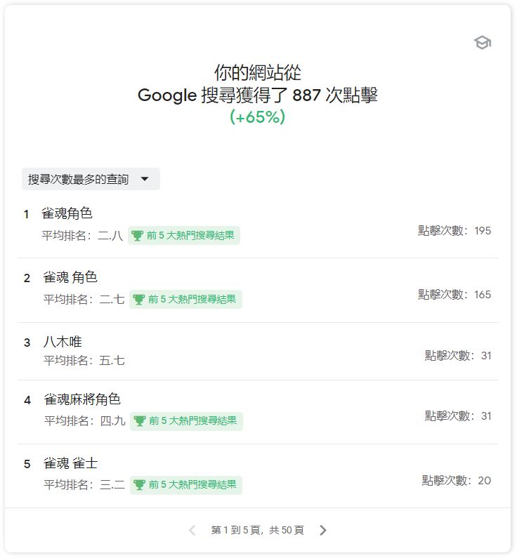
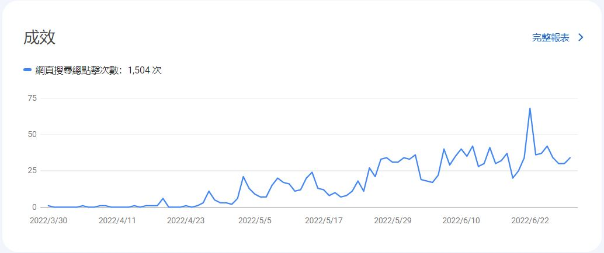
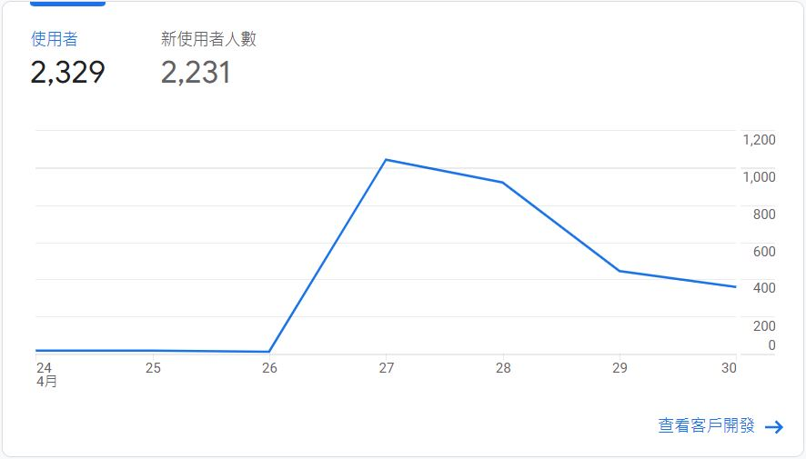

# 建立遊戲情報網站的歷程分享
本文將分享我建立 [雀魂麻將情報](https://mjsinfo.pages.dev/) 網站的歷程。

## 成果
(最後更新時間 2022/7/1)

### 前 5 大熱門搜尋結果

### Google 搜尋影響力成就

### 網頁 Google 搜尋總點擊次數

### 單週最高使用者人數
2022年4月27日，遊戲有版本更新，所以網站訪問量爆增。

## 經過
在 2022年3月某天，我想知道雀魂角色的語音在說什麼，最好有中文、日文台詞對照，但搜尋了一陣子沒找到我要的東西，最多只有全日文的網站。

於是我就想：不如我來整理弄成一個網站。

我就開始著手收集資料，我花了一天的時間研究並從雀魂伺服器上爬取了遊戲的資料。

接著要決定用什麼工具來做網站，我是想做純展示資料的靜態網站，所以不需要考慮後端功能。

如果用熟悉的 Vue + Vue-router 做成 SPA 是可行，但我想要更友善的 SEO ，也想順便學習新的技術。

原本我是想順便學習 Nuxt，用 Nuxt 的靜態渲染功能來做，但爬了一下發現 Nuxt 準備出 3 了，現在學 2 感覺不是很划算。

所以我就看中了 Hugo ，號稱最快的靜態網站生成器。

### Hugo
Hugo 是基於 golang 的工具，由於我沒碰過 go ，所以還算有新鮮感；Hugo 被編譯成一個執行檔，所以使用起來很方便，電腦不用安裝 go 也能使用 Hugo。

我花了幾天的時間研究 Hugo 的模板語法、目錄結構、內容管理等等功能，成功把網站做了出來。

我把網站部署在 Cloudflare Pages 服務上，結合 Github ，當主分支有 commit 的時候幫我自動部署。

由於沒有前端設計稿，所以關於畫面的部分我是想到什麼就寫什麼，CSS 的部分寫得比較凌亂，尤其是首頁可能做得不是很好看 T_T (如果以後有想法再改善)。

## 收穫
- 累積 JavaScript 逆向經驗
- 累積 SEO 優化經驗
- 學習 Hugo
- Cloudflare Pages 使用經驗
- Google Search Console, Google Analytics 使用經驗